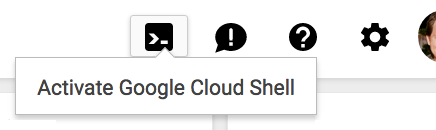
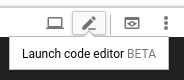

# Getting Started with GCP

## Module Objectives

Before getting started, you first have to prepare the environment for the workshop.

1. Get a GCP account from the instructor
1. Connect to the Cloud Shell using the GCP account
1. Enable the necessary APIs
1. Set computing zone and project
1. Download the lab source code from GitHub

---

## Google Cloud Platform Overview

- Managed by Google
- Provides basic resources like compute, storage and network
- Also provides services like Cloud SQL and Kubernetes engine
- All operations can be done through the API
- SLAs define reliability guarantees for the APIs
- Three ways of access
  - API calls
  - SDK commands
  - Cloud Console web UI

Google Cloud Computing service groups:

- Compute
- Storage
- Migration
- Networking
- Databases
- Developer Tools
- Management Tools

You will use these services while doing the lab:

- IAM & Admin: Manage users and permissions
- Compute Engine: Run virtual machines for worker nodes
- VPC Network: Connectivity between the nodes
- Load Balancing: Create Ingress of LoadBalancer type

Cloud Console is the admin user interface for Google Cloud. With Cloud Console you can find and manage your resources through a secure administrative interface.

Cloud Console features:

- Resource Management
- Billing
- SSH in Browser
- Activity Stream
- Cloud Shell

Projects

- Managing APIs
- Enabling billing
- Adding and removing collaborators
- Managing permissions for GCP resources

Zonal, Regional, and Global Resources

- Zone: Instances and persistent disks
- Region: Subnets and addresses
- Global: VPC Network and firewall

---

## Google Cloud Platform (GCP) Account

In this workshop you will run Kubernetes in GCP. We have created a separate project for each student. You should receive an email with the credentials to log in.

We recommend using Google's Chrome browser during the workshop.

1. Open in a new tab: https://console.cloud.google.com/
1. Enter the provided username
1. Enter the provided password

    > Note: Sometimes GCP asks for a verification code when it detects logins from unusual locations. It is a security measure to keep the account protected. If this happens, please ask the instructor for the verification code.

1. In the top left corner select the project "XXXXXXXXXXXXX-yyyyyy", where XXXXXXXXXXXXX matches the name of the e-mail you were given

## Cloud Shell

Console is the UI tool for managing cloud resources. Most of the exercises in this course are done from the command line, so you will need a terminal and an editor.

1. Click "Activate Cloud Shell" button in the top right corner.

   

   This will open up a cloud shell window at the bottom of the screen. This is a VM dedicated to the user.

1. We would also like to open up the Code Editor. You will use the code editor for manipulating files on the Cloud Shell VM.

   Click the pencil icon in the top left of the cloud shell window

   

   A new window will open up with both the cloud shell at bottom and code editor at the top.

## Download the Lab Source Code from GitHub

Go to your home directory

```shell
cd ~
```

> IMPORTANT: We will clone the repo into the home directory, and several subsequent commands expect this directory structure.

Clone the lab repository in your cloud shell, then `cd` into that directory:

```shell
git clone https://github.com/Altoros/k8s-training-lab-development.git kubernetes-training
```

> Note: you will need to login with your Github username and password. Alternately you can use a [Developer Personal Access Token](https://github.com/settings/tokens).

If needed, you can pull the repo over SSH. You may need to setup an SSH key. [See instructions here](https://help.github.com/en/articles/connecting-to-github-with-ssh).

```shell
git clone git@github.com:Altoros/k8s-training-lab-development.git kubernetes-training
```

> IMPORTANT: Inside our repo will be a `workspace/` folder. We will do all our work from this directory, unless otherwise noted.

```shell
cd ~/kubernetes-training/workspace/
```

## Set Project id, Computing Zone and Region

Run the following to set your cloud shell on your project and use region and zone settings. You should only need to do this once.

```shell
source ~/kubernetes-training/shell_setup.sh
```

This will perform `gcloud init` if the shell has not been configured for a project yet.

If prompted from `gcloud init`, the following options should work:
1. Enter `1` - `[1] Re-initialize this configuration [cloudshell-8672] with new settings`
1. Enter `1` - `[1] gcptraining1@altoros.com` or the email that is correct for your training account
1. Enter `1` - `[1] gcptraining1-217395` or the project ID that matches your training account
1. Enter `y` - `Do you want to configure a default Compute Region and Zone? (Y/n)?`
1. Enter `12` - `[12] us-west1-c` - this is the zone we will use throughout the course

After these steps, your project name should be shown in yellow in the command prompt.

This script does the following:
* Adds the following to `.bashrc` so that these are set every time you login:
  * export `PROJECT_ID` as an environment variable
  * set Project, Zone and Region settings with `gcloud`
  * sets up `kubectl` autocompletion

You can check for additional information with:

```shell
gcloud info
```

## Enable APIs

As a project owner, you control which APIs are accessible for the project. Enable the APIs which are required for the workshop:

View initial setup:

```shell
gcloud services list --enabled
```

Enable services we will use:
```shell
gcloud services enable \
  compute.googleapis.com \
  monitoring.googleapis.com \
  logging.googleapis.com \
  stackdriver.googleapis.com \
  storage-api.googleapis.com
```

The operation will return once complete. Enabling all these apis will take about 5m.

```shell
gcloud services list --enabled
```

```
NAME                        TITLE
compute.googleapis.com      Compute Engine API
logging.googleapis.com      Stackdriver Logging API
monitoring.googleapis.com   Stackdriver Monitoring API
oslogin.googleapis.com      Cloud OS Login API
stackdriver.googleapis.com  Stackdriver API
```

> Note: Notice how some APIs are enabled as dependencies, such as Cloud OS Login.
