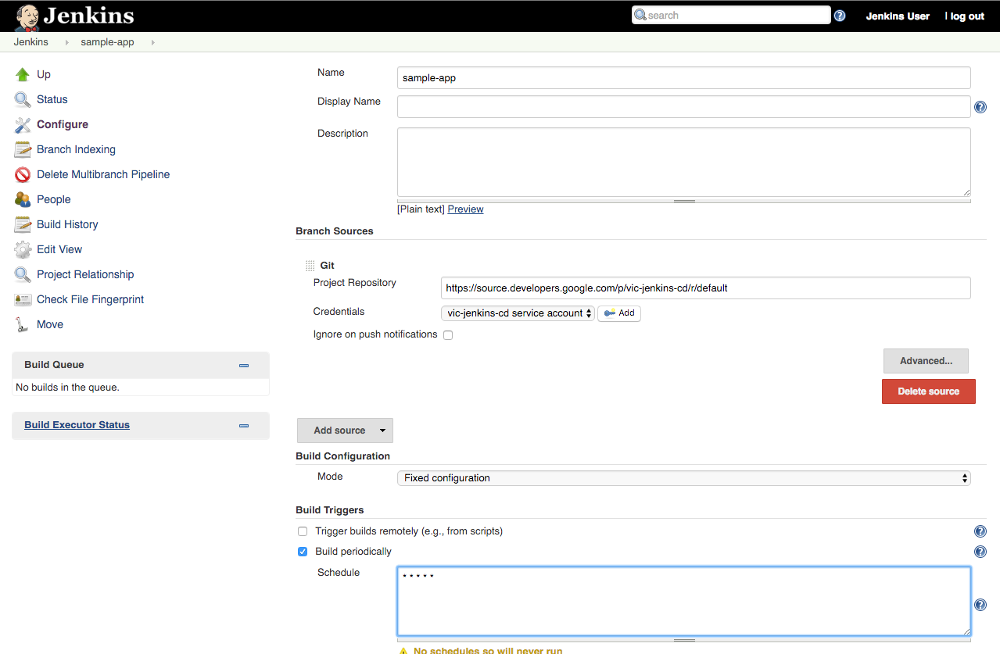

Build Pipeline
-------------------

Create a pipeline that builds application images using Google Container Builder service.

1. We will be creating a `Jenkinsfile` in the `sample-app` folder, and we will start with variables:

    ```shell
    echo "def project = '"$PROJECT_ID"'
    def  appName = 'gceme'
    def  feSvcName = \"\${appName}-frontend\"
    def  imageTag = \"gcr.io/\${project}/\${appName}:\${env.BRANCH_NAME}.\${env.BUILD_NUMBER}\"" > Jenkinsfile
    ```

    `project` is the project we are working in

    `appName` is the name of sample application

    `feSvcName` name of the frontend service to expose the app

    `imageTag` must be unique identifier for the Docker image. It uses the BUILD_NUMBER and BRANCH_NAME enviornmental variables

1. Create empty pipeline

    ```java
    pipeline {
      agent {}
      stages {}
    }
    ```

    `agent` section describes container images that Jenkins may use to build the application

    `stages` define structure of the pipeline. It is a list of `stage()` objects and transitioning rules

1. Add image with Google SDK installed **(YAML which we are adding below after three double quotes """ cares about spacing, pay especial attention to that as you add more to this file. Issues it will cause is slave pod will not start)**

    ```java
        agent {
            kubernetes {
              label 'sample-app'
              defaultContainer 'jnlp'
              yaml """
    apiVersion: v1
    kind: Pod
    metadata:
    labels:
      component: ci
    spec:
      serviceAccountName: cd-jenkins
      containers:
      - name: gcloud
        image: gcr.io/cloud-builders/gcloud
        command:
        - cat
        tty: true
    """
    }
            }
    ```

    Jenkins uses `cd-jenkins` service account to start build containers.

1. Add phase to build the application image and push it to Container Registry

    ```java
    stages{
      stage('Build and push image with Container Builder') {
        steps {
          container('gcloud') {
            sh "PYTHONUNBUFFERED=1 gcloud builds submit -t ${imageTag} ."
          }
        }
      }
    }
    ```

1. Commit changes to the `master` branch

    ```
    git add .
    git commit -m "Add build pipeline"
    git push origin master
    ```

In the next step you will run the pipeline and see Docker image created in the registry.

Create a job
------------

This lab uses [Jenkins Pipeline](https://jenkins.io/solutions/pipeline/) to define builds as groovy scripts.

Navigate to your Jenkins UI and follow these steps to configure a Pipeline job (hot tip: you can find the IP address of your Jenkins install with `kubectl get svc cd-jenkins --namespace cd`):

1. Click the “Jenkins” link in the top left of the interface

1. Click the **New Item** link in the left nav

1. Name the project **sample-app**, choose the **Multibranch Pipeline** option, then click `OK`

1. Click `Add Source` and choose `git`

1. Paste the **HTTPS clone URL** of your `sample-app` repo on Cloud Source Repositories into the **Project Repository** field.
    It will look like:
    ```
    echo https://source.developers.google.com/p/$PROJECT_ID/r/gceme
    ```

    Output:
    ```
    https://source.developers.google.com/p/cloud-training-4-211211/r/gceme
    ```

1. From the Credentials dropdown select the name of new created credentials from the Phase 1. It should have the format `$PROJECT_ID service account`.

1. Under 'Scan Multibranch Pipeline Triggers' section, check the 'Periodically if not otherwise run' box and se the 'Interval' value to 1 minute.

1. Click `Save`, leaving all other options with their defaults

  

A job entitled "Branch indexing" was kicked off to identify the branches in your repository. If you refresh Jenkins you should see the `master` branch now has a job created for it.
