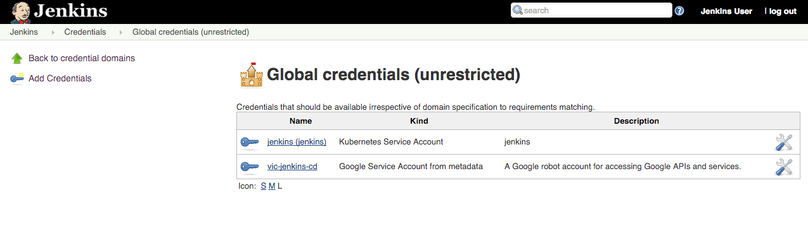

Pipeline Prerequisites
=================

Module objectives
-----------------

- create a repository for the sample app source
- add your service account credentials

Create a repository for the sample app source
----------------------------------------------

Here you'll create your own copy of the `gceme` sample app in [Cloud Source Repository](https://cloud.google.com/source-repositories/docs/).

1. Change directories to `sample-app` of the repo you cloned previously, then initialize the git repository.

    ```shell
    # make sure you are still in sample-app directory
    git init
    git config credential.helper gcloud.sh
    gcloud source repos create gceme
    ```

    Once repo is created we will have to add remote
    ```
    git remote add origin https://source.developers.google.com/p/$PROJECT_ID/r/gceme
    ```

1. Ensure git is able to identify you:

    ```
    git config --global user.email "dev@company.com"
    git config --global user.name "k8s expert"
    ```

1. Add, commit, and push all the files:

    ```
    git add .
    git commit -m "Initial commit"
    git push origin master
    ```

Add your service account credentials
------------------------------------

First, we will need to configure our GCP credentials in order for Jenkins to be able to access our code repository

1. In the Jenkins UI, click “Credentials” on the left
1. Click on the “(global)” link
1. Click “Add Credentials” on the left
1. From the “Kind” dropdown, select “Google Service Account from metadata”
1. Click “OK”

You should now see your Global Credentials. Make a note of the name of the credential as you will reference it in Phase 2:


